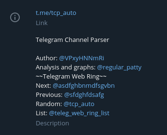

# WebRing Telegram
Telegram based WebRing realisation.

---

Telegram WebRing can be used to make possible for Telegram users surf through channels, that are "neighbors": relative theme, same ideology, etc. Whole system works in the descriptions of the channels, so users can anytime find the Webring and go to reading content in the next channel.
<p align="left">
    
</p>

## Usage

- `/admin_help` - to get information, that written here.
- `/add` - adding channel to list. </br>
Before adding channel to the list, administrator of the channel has to add bot with permissions to send messages and modify channel info. If bot doesn't has enough permissions - it will return error message in private chat with Ring Master (Web Ring administrator).</br>
Due to Telegram restrictions, description of the channel can be up to 256 characters. WebRing uses at least 110-120 characters, so it is the second requirement to add the channel. Bot **won't** add channel, that doesn't have enough space in the description to create WebRing.</br>
**IMPORTANT**: Telegram has delay in updating info, so you will have to wait about 1-2 minutes, after changing description, to make a try to add channel.</br>
- `/remove` - removing channel from the list and deleting bot from channel. </br>
- `/list` - get list of the channels.

## Installation and configuration
### Installation
First of all, this project written on Python, so you will have to install Python package on your system. You can find packages for different operating systems on Python official page.
On the next step you will have to download this repository. My recommendation is to use Git, but you can use what ever you want. 
Command for git:
```
git clone https://github.com/Antcating/webring_telegram.git
cd webring_telegram
python3 main.py
```

After downloading you have to install dependencies:
    
```
pip3 install -r requirements.txt
```
### Configuration
Before the first run, you **have to** change configuration file _config.ini_:
```
[TelegramBot]
token = bot_token

[AdminPanel]
ids = admin_id 

[ChannelList]
link = special channel with list of members 

[WebRing]
text = ~~Telegram Web Ring~~
```
All of the rows are necessary to make the Ring working.  
- WebRing uses Telegram Bots to automatize the administration of the ring, so you will have to go to [BotFather](https://t.me/BotFather) and create bot using its instructions. After creating bot, BotFather will return token to access the HTTP API. You will have to copy-paste it to the configuration file on the 'token' row.
- To improve the security of the WebRings, only approved administrators will be able to make changes in the channel list. So, you have to get your (and, if you want, other people) Telegram id's. You can to it, for example, using this [bot](https://t.me/userinfobot). Your id's you paste to the config on the 'ids' row.
- For the convenience of users, bot has to have the public WebRing list of the channels. So, you have to create a **public** channel and add bot there with permission to send messages. After adding bot to the channel, you will paste the link to the channel in **this format: @channel_name** to the 'link' row of the config.
- The last one, the 'text' row is used to name your WebRing. Everyone will see it on the begging of Ring widget. Try not to make it to long: up to 30 characters. It is not necessary to change it, if you don't want to.

## Thanks
- [PyTelegramBotApi](https://github.com/eternnoir/pyTelegramBotAPI)
- [XXIIVV Github Repo](https://github.com/XXIIVV)

Inspired by: https://xxiivv.com/ 