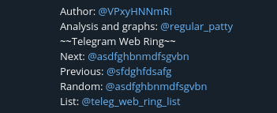

# Web Ring Telegram
Реализация WebRing на основе Telegram.


Read on [English](https://github.com/Antcating/webring_telegram/blob/main/README.md) | Читать на [русском](https://github.com/Antcating/webring_telegram/blob/main/README_ru.md)

---

Telegram WebRing можно использовать, чтобы пользователи Telegram могли просматривать каналы, которые являются «соседями»: схожая тема, идеология и т. д. Вся система работает в описаниях каналов, поэтому пользователи могут в любое время найти Webring и перейти к изучению контента в следующем канале.
<p align="left">
     </br>
    *Web Ring example*
</p>

## Применение

- /admin_help - получить информацию, написанную здесь.
- /add - добавить канал в список. </br>
Перед добавлением канала в список администратор канала должен добавить бота с разрешениями на отправку сообщений и изменение информации о канале. Если у бота недостаточно прав - он вернет сообщение об ошибке в приватном чате с Ring Master (администратором Web Ring). </br>
Из-за ограничений Telegram описание канала может содержать до 256 символов. Web Ring использует не менее 110–120 символов, поэтому свободное место в описании является обязательным требованием. Бот не будет добавлять канал, в описании которого недостаточно места для создания Web Ring. </br>
ВАЖНО: В Telegram имеется задержка в обновлении информации, поэтому вам придется подождать 1-2 минуты после изменения описания, чтобы попытаться добавить канал после ошибки. </br>
- /remove - удаление канала из списка и удаление бота из канала. </br>
- /list - получить список каналов.

## Установка и настройка
### Монтаж
Прежде всего, этот проект написан на Python, поэтому вам нужно будет установить пакет Python в систему, на которой будет работать бот. Вы можете найти пакеты для разных операционных систем на официальной странице Python.
На следующем шаге вам нужно будет скачать этот репозиторий. Я рекомендую использовать Git, но вы можете использовать средства, которые вам удобны.
Команда для git:
```
git clone https://github.com/Antcating/webring_telegram.git
cd webring_telegram
python3 main.py
```

После скачивания вам необходимо установить зависимости:
```
pip3 install -r requirements.txt
```

### Конфигурация
Перед первым запуском необходимо изменить файл конфигурации _config.ini_:
```
[TelegramBot]
token = bot_token

[AdminPanel]
ids = admin_id 

[ChannelList]
link = special channel with list of members 

[WebRing]
text = ~~Telegram Web Ring~~
```
Все строчки должны быть корректно заполнены, чтобы кольцо заработало.
- WebRing использует ботов Telegram для автоматизации администрирования кольца, поэтому вам нужно будет перейти на [BotFather](https://t.me/BotFather) и создать бота, используя инструкции от BotFather. После создания бота, BotFather вернет токен для доступа к HTTP API. Вам нужно будет скопировать и вставить его в файл конфигурации в строке `token`.
- Для повышения безопасности WebRings только утвержденные администраторы смогут вносить изменения в список каналов. Для добавление подтвержденных администраторов, вы должны получить свой (и, если хотите, других людей) id Telegram. Вы можете сделать это, например, с помощью этого [бота](https://t.me/userinfobot). Ваш идентификатор вы вставляете в конфигурацию в строке `ids` (если несколько человек должны иметь доступ – введите все id через запятую).
- Для удобства пользователей бот должен иметь публичный список каналов WebRing. Итак, вам нужно создать публичный канал и добавить туда бота с разрешением на отправку сообщений. После добавления бота на канал вы вставите ссылку на канал в следующем формате: @channel_name в строку `link` в конфигурации.
- Последняя строка `text` используется для названия вашего Web Ring. Название отображается в начале виджета Web Ring. Постарайтесь не затягивать и уложиться до 30 символов в длину. Данное поле имеет значение по-умолчанию, его не обязательно менять, если вы этого не хотите.

## Благодарности
- [PyTelegramBotApi](https://github.com/eternnoir/pyTelegramBotAPI)
- [XXIIVV Github Repo](https://github.com/XXIIVV)

Вдохновлено: https://xxiivv.com/